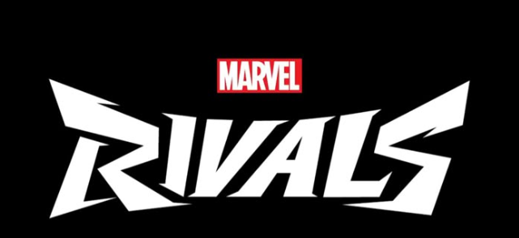
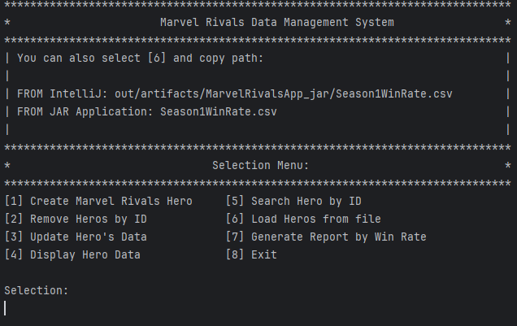
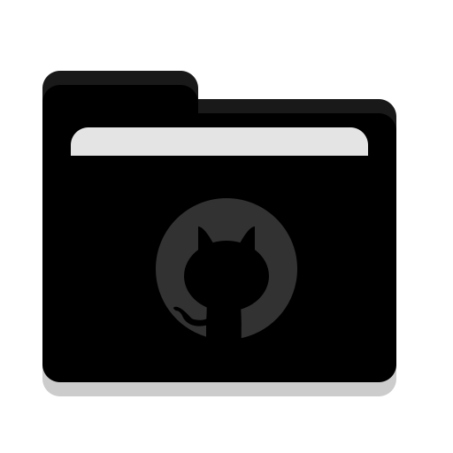
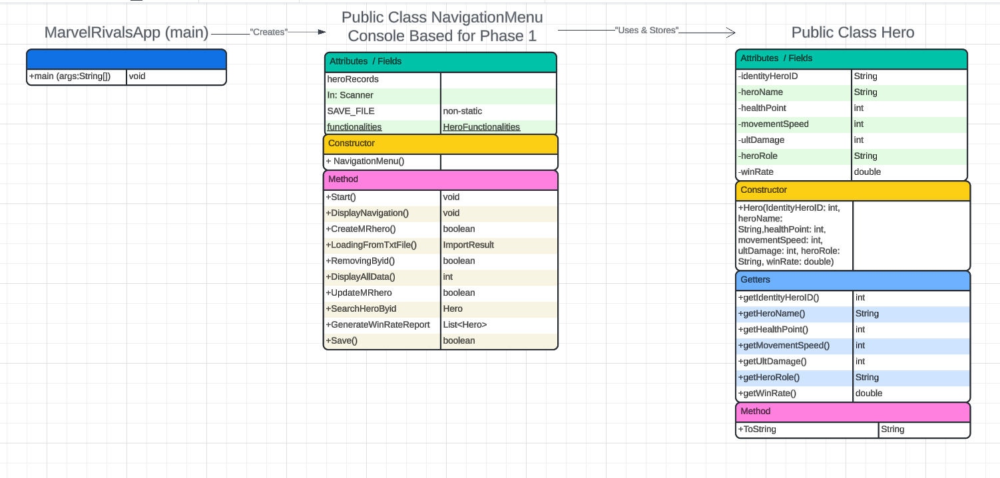

# COP-3330C-Module-7-Phase1 
This Repository was created for Software Implementation Phase 1 - Logic and Input Validation. It includes the .zip file / and the resources that the program uses.

**Name:** Kenji Nakanishi 
**Course:** CEN 3024C Software Development-I 
**CRN:** 14877

**Description of the project: **

Marvel Rivals is a shooting game that is becoming very popular among PC & PS5 gamers. I also enjoy this game so much that I wanted to create a DMS based on this game!

This console based a will allow user to use Create, Remove. Update, Delete hero records (Marvel Rivals) from the file stored either can be used .txt or .csv or open from your personal computer. It has a custom method which creates a PDF on Win Rate % calculated by the MarvelRivals.com where they base on the won matches / matches played * 100.

I have collected this records with +42 data of the current season as of October 2025 for our use.
** you can also load your personal file, just need to type the absolute path!

This application is going to evolve to have a Graphic Interface + Database integration! 
It will come different version for these updates. 

** Screenshot of the application on the console NavigationMenu **

[1] Create Marvel Rivals Hero     [5] Search Hero by ID
[2] Remove Heros by ID            [6] Load Heros from file
[3] Update Hero's Data            [7] Generate Report by Win Rate
[4] Display Hero Data             [8] Exit

Followed UML diagram designed for our project!

This console based app basically work with the below 3 files:

**MarvelRivalApp.java** 
which contain the main method which will start the program

**Hero.java** 
which contains the formatting of how the user requested to be the input
example:
IdentityHeroID-heroName-healthPoint-movementSPeed-ultDamage-heroRole-winRate
018-Jeff the Land Shark-250-6-4500-Strategist-50.60%

**NavigationMenu.java** 
that holds most of the methods:
+Start()
+DisplayNavigation()
+CreateMRhero()
+LoadingFromTxtFile()
+DisplayAllData()
+UpdateMRhero
+SearchHeroByid
+GenerateWinRateReport
+Save()

These methods have been tested with a sample data stored under Season1WinRate.csv
  

The UML model is as follow:
Where MarvelRivalsApp creates NavigationMenu and this Uses & Stores heroRecords.

**Tools used:**
- Java language
- IDE: JetBrain IntelliJ IDE
- Maven
- Canva
  
